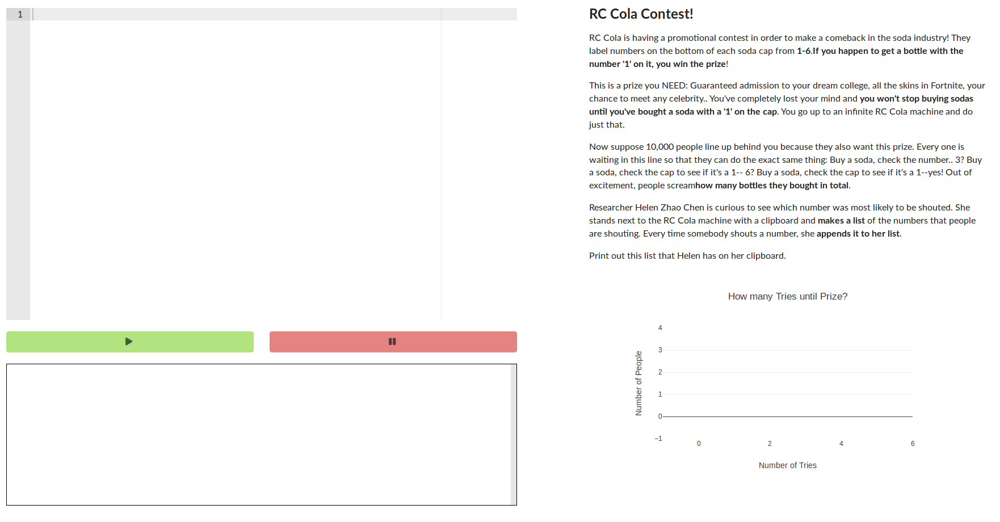
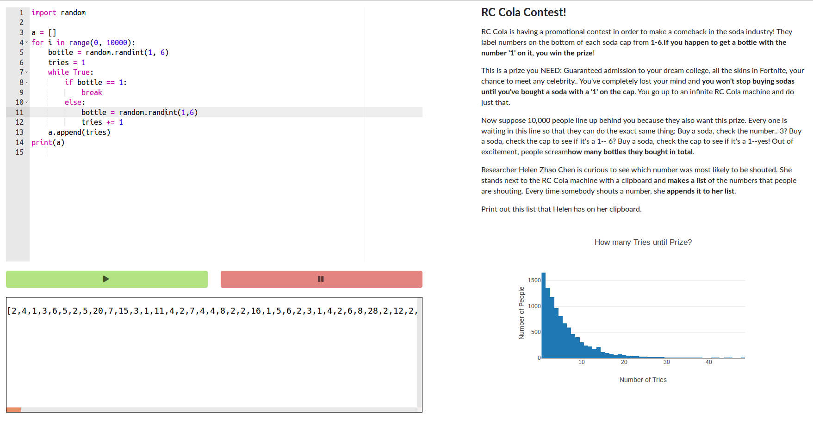
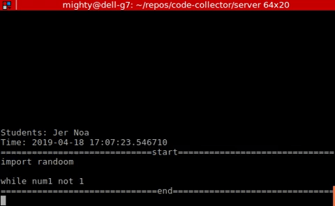

# code-collector

Designed specifically for a lesson taught at [El Cerrito High School](http://elcerritogauchos.net/) on 04/18/19, this web application is used to collect students code periodically as they solve the RC Cola Problem. Code is saved from the Text Editor every 10 seconds, which can be used for later data analysis--"How are students new to coding debugging? What separates those that could finish the problem from those who couldn't?"

Template for front end and back-end by @jsanchez254, and tweaked specifically for this project.

The application features an in-browser Python text editor (with bad security), which will send code to the server side and compile it on a Heroku server. When an array is sent back, the client will generate a histogram from that array.

As students work on this problem, the client also sends post methods in order to 'autosave' their code. It is possible to retrieve this code to play it back again, to watch how the student works out the problem:

Additional work on data analysis to come in the following weeks..
